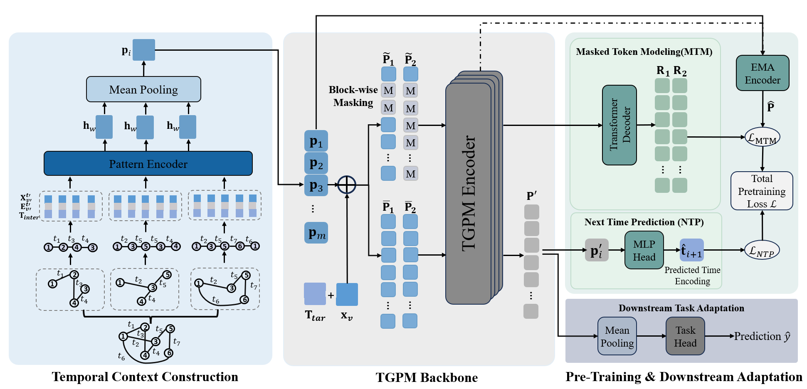

# Temporal Graph Pattern Machine (TGPM)

This is the official PyTorch implementation of [**Temporal Graph Pattern Machine (TGPM)**](https://arxiv.org/abs/2601.22454), a pattern-centric foundation framework for temporal graph learning.

TGPM shifts temporal graph modeling from task-centric, node-level heuristics to **explicitly learning generalizable evolving patterns**, enabling strong performance and transferability across domains and temporal regimes.

---

## ✨ Method Overview

The overall framework is featured by:

- **Pattern-centric temporal modeling**  
  Learn evolving interaction semantics instead of node-centric temporal embeddings.

- **Interaction patches via temporally biased random walks**  
  Capture long-range dependencies and dynamic structural semantics beyond immediate neighborhoods.

- **Transformer-based backbone**  
  Model global temporal regularities and context-dependent evolution.

- **Self-supervised pre-training**  
  - Masked Token Modeling (MTM) for multi-scale temporal dependency learning  
  - Next Time Prediction (NTP) for explicit prospective temporal modeling

- **Strong transferability**  
  Consistently outperforms prior methods in both in-domain and cross-domain temporal link prediction.

- **Strong Scalability**
  Continued performance improvement up to 160M parameter.

<p align="center">
  
</p>


---

## 🚀 Quick Start

### Setup

Install dependencies via:

```bash
pip install -r requirements.txt
```

Supported datasets `Enron`, `ICEWS1819`, `Googlemap CT` can be downloaded from [here](https://drive.google.com/drive/folders/1pn03tqbszITmL9xwfPn69GJ3UoiDbEmg?usp=sharing). Unzip dataset files under `processed_data/`, and run `preprocess.py` to preprocess raw datasets.

### Basic Usage

To pre-train TGPM with default parameters:

```bash
python train_link_prediction.py --dataset_name googlemap --run_name TGPM --pre_train
```

To fine-tune TGPM with default parameters:

```bash
python train_link_prediction.py --dataset_name googlemap --run_name TGPM --ft
```

To directly train TGPM from scratch:

```bash
python train_link_prediction.py --dataset_name googlemap --run_name TGPM
```

For each run, you must specify different `--run_name` to avoid checkpoint override. Please refer to `run.sh` for our recommended hyperparameter settings in different stages. Running logs can be found under `logs/`, while model checkpoints can be found under `saved_models/`.


---

## 🔧 Configuration Options

We list some important configuration options below:

### Basic Parameters
- `--dataset_name`: dataset(s) to use. Supported: `icews`, `enron`, `googlemap`. If you are interested, you may pass multiple datasets separated by comma (e.g., `icews,enron,googlemap`) for multi-dataset training.
- `--eval_dataset`: index of the dataset (in the comma-separated list) used for evaluation.
- `--run_name`: experiment name (affects logging and checkpoint paths).

### Temporal Context Representation
- `--num_neighbors`: number of historical interaction to sample per node.
- `--sample_neighbor_strategy`: neighbor sampling strategy  
  choices: `uniform`, `recent`, `time_interval_aware` (default: `recent`)
- `--num_walk`: number of temporally-biased random walks sampled per interaction.
- `--walk_length`: length of each random walk.
- `--causal_path`: use chronologically monotonic causal paths instead of non-monotonic temporal walks (ablation).

### TGPM Architecture
- `--hidden_dim`: hidden dimension of TGPM encoder.
- `--time_feat_dim`: time encoding dimension.
- `--num_heads`: number of TGPM encoder attention heads.
- `--encoder_layers`: number of Transformer encoder layers.
- `--decoder_layers`: number of Transformer decoder layers.

### Pre-Training Objectives & Masking
- `--no_ntp`: disable Next Time Prediction (NTP).
- `--no_lt`: disable long-term block-wise masking.
- `--no_st`: disable short-term block-wise masking.
- `--random_mask`: use random masking instead of block-wise masking (ablation).
- `--block_size`: masked block size for short-term block-wise masking.
- `--visible_ratio`: ratio of total visible interaction patches.

### Negative Sampling
- `--negative_sample_strategy`: negative edge sampling strategy  
  choices: `random`, `historical`, `inductive` (default: `random`)

For complete configuration options, please refer to `utils/load_configs.py`.

---

## 📦 Repository Structure

```text
TGPM/
├── models/             # TGPM backbone and components
├── assets/             # Images and assets
├── utils/              # Utility functions
├── processed_data/     # Dataset storage (Manually create)
├── patterns/           # Sampled pattern storage (Automatically create)
├── train_link_prediction.py   # Main Entry point
├── evaluate_model_utils.py    # Evaluation functions
├── preprocess.py              # Data preprocess
├── run.sh                     # Recommended full running script
└── README.md
```

## 📚 Citation

If you find this work useful, please cite our paper:

```bibtex
@article{ma2026temporal,
  title={Temporal Graph Pattern Machine},
  author={Ma, Yijun and Wang, Zehong and Sun, Weixiang and Ye, Yanfang},
  journal={arXiv preprint arXiv:2601.22454},
  year={2026}
}
```

## 👥 Authors

- [Yijun Ma](https://antman9914.github.io/)
- [Zehong Wang](https://zehong-wang.github.io/)
- [Weixiang Sun](https://weixiang-sun.github.io/)
- [Yanfang Ye](http://yes-lab.org/)

For questions, please contact `yma7@nd.edu`.

## 🙏 Acknowledgements

This repository builds upon the excellent work from:
- [G2PM](https://github.com/Zehong-Wang/G2PM/tree/main)
- [DyGLib](https://github.com/yule-BUAA/DyGLib/tree/master)
- [DTGB](https://github.com/zjs123/DTGB)

We thank these projects for their valuable contributions to the field.